<div align="center">



**Full-Stack Developer** &nbsp;·&nbsp; **Cybersecurity** &nbsp;·&nbsp; **AI Systems** &nbsp;·&nbsp; **Automation** &nbsp;·&nbsp; **Software Architecture**

I build systems. I break assumptions. I secure what matters.

<a href="https://aryaniq.com"></a>
<a href="#selected-systems"></a>
<a href="https://cybersec-iq.github.io/cybersec-iq/snake/"></a>
<a href="https://aryaniq.com"></a>


</div>

## `~/whoami`

<div align="center">



</div>


## `~/about`

I design and ship production systems end to end — interface, API, data layer,
infrastructure and the automation that keeps them running. Most of my work sits
where **product engineering meets security**: platforms that handle real users,
real payments and real data, built so that the boring parts are automated and
the risky parts are deliberate.

**How I work**

- **Security is a design input, not a review step.** Threat assumptions get
  written down before the schema does.
- **Automate the repeatable.** If a task happens twice, it becomes a script,
  a pipeline or a bot.
- **Boring infrastructure, interesting products.** Predictable deploys are what
  make ambitious features affordable.
- **Own the whole path.** From `git init` to the production incident at 2am.
- **Ship, measure, harden.** Working beats perfect — then perfect the parts
  that carry risk.


## `~/stack`

| Layer | Technologies |
| :--- | :--- |
| **Frontend** |     |
| **Backend** |    |
| **Data** |  |
| **Infrastructure** |     |
| **Security practice** |     |


## `~/currently-building`

```text
[ ACTIVE ]  AI-assisted software      LLM-backed features inside real products,
                                      not demos — retrieval, agents, evaluation.

[ ACTIVE ]  Automation systems        Bots and pipelines that remove manual
                                      operations from day-to-day business flow.

[ ACTIVE ]  SaaS platforms            Multi-tenant products: auth, billing,
                                      admin surfaces, tenant isolation.

[ ONGOING ] Security tooling          Internal utilities for hardening,
                                      dependency review and safe deployment.

[ ONGOING ] Developer infrastructure  CI/CD, reproducible environments and the
                                      release plumbing everything else sits on.
```


## `~/selected-systems`

Most of this work lives in private repositories. What follows is a high-level
map — architecture and implementation details stay closed.

| System | Domain | Stack | Access |
| :--- | :--- | :--- | :--- |
| **ARYANIQ** | Personal platform &amp; engineering hub | TypeScript · Web | [Live ↗](https://aryaniq.com) |
| **KAMINO RECORDS** | Music label platform | Next.js · Headless CMS · PostgreSQL | Private |
| **SHINEL SUPPLIER** | Multilingual commerce platform | TypeScript · Web | Private |
| **XPRIME** | Product platform | TypeScript | Private |
| **XOS** | Private system | — | Undisclosed |
| **XADMIN** | Private system | — | Undisclosed |

> Source code, infrastructure topology and client data for private systems are
> not published. Nothing in this profile is a claim about scale, revenue or
> third-party endorsement.


## `~/activity`

<div align="center">


</div>

### Contribution grid

<div align="center">

<picture>
  <source media="(prefers-color-scheme: dark)" srcset="https://raw.githubusercontent.com/cybersec-iq/cybersec-iq/output/github-contribution-grid-snake-dark.svg">
  <source media="(prefers-color-scheme: light)" srcset="https://raw.githubusercontent.com/cybersec-iq/cybersec-iq/output/github-contribution-grid-snake.svg">
  
</picture>

<sub>Both assets are regenerated daily by <a href="https://github.com/cybersec-iq/cybersec-iq/actions/workflows/profile-assets.yml">.github/workflows/profile-assets.yml</a> &#183; rendered from the GitHub API, never hand-edited</sub>

</div>


## `~/run snake`

A real, playable Snake — original build, no framework, no trackers, no
dependencies. Keyboard on desktop, swipe or on-screen pad on mobile.

<div align="center">

<a href="https://cybersec-iq.github.io/cybersec-iq/snake/"></a>

**[cybersec-iq.github.io/cybersec-iq](https://cybersec-iq.github.io/cybersec-iq/)** — command center &amp; interactive console
<br>
**[/snake](https://cybersec-iq.github.io/cybersec-iq/snake/)** — SNAKE PROTOCOL

</div>

```text
CONTROLS   Arrow keys · W A S D · swipe · on-screen pad
PAUSE      Space or P
RESTART    R
STATE      score · high score · length · live status
```


## `~/contact`

| | |
| :--- | :--- |
| **Website** | [aryaniq.com](https://aryaniq.com) |
| **GitHub** | [@cybersec-iq](https://github.com/cybersec-iq) |
| **Location** | Muscat, Oman |
| **Enquiries** | via [aryaniq.com](https://aryaniq.com) |

<div align="center">


<sub>Built with original SVG assets, zero runtime dependencies and a hardened GitHub Actions pipeline.<br>
Source for this profile: <a href="https://github.com/cybersec-iq/cybersec-iq">cybersec-iq/cybersec-iq</a></sub>

**`NOTHING IS IMPOSSIBLE.`**

</div>
