

<picture>
  <source media="(max-width: 500px)" srcset="assets/sections/hero-narrow.svg">
  
</picture>

<a href="https://cybersec-iq.github.io/cybersec-iq/#projects"></a>
<a href="https://cybersec-iq.github.io/cybersec-iq/#stack"></a>
<a href="https://cybersec-iq.github.io/cybersec-iq/snake/"></a>

 

<picture>
  <source media="(max-width: 500px)" srcset="assets/sections/whoami-narrow.svg">
  
</picture>

<picture>
  <source media="(max-width: 500px)" srcset="assets/sections/about-narrow.svg">
  
</picture>

<picture>
  <source media="(max-width: 500px)" srcset="assets/sections/stack-narrow.svg">
  
</picture>

<picture>
  <source media="(max-width: 500px)" srcset="assets/sections/systems-narrow.svg">
  
</picture>

<picture>
  <source media="(max-width: 500px)" srcset="https://raw.githubusercontent.com/cybersec-iq/cybersec-iq/output/activity-narrow.svg">
  
</picture>

<picture>
  <source media="(max-width: 500px)" srcset="https://raw.githubusercontent.com/cybersec-iq/cybersec-iq/output/snake-framed-narrow.svg">
  
</picture>

<a href="https://cybersec-iq.github.io/cybersec-iq/snake/">
  <picture>
    <source media="(max-width: 500px)" srcset="assets/sections/snake-cta-narrow.svg">
    
  </picture>
</a>

<picture>
  <source media="(max-width: 500px)" srcset="assets/sections/contact-narrow.svg">
  
</picture>

<picture>
  <source media="(max-width: 500px)" srcset="assets/sections/footer-narrow.svg">
  
</picture>

<!--
  Text mirror of the command center above.

  The profile is rendered as SVG because GitHub sanitises HTML and CSS in
  READMEs, so the reference layout cannot be built with markup. Every image
  carries full alt text; this block keeps the same content readable in the raw
  file and to plain-text tooling. It is intentionally not rendered.

  ARYAN IQ — Full-Stack Developer · Cybersecurity Engineer · AI Systems Builder
  Muscat, Oman · https://aryaniq.com · https://github.com/cybersec-iq

  Stack     React, Next.js, TypeScript, JavaScript, Node.js, Python, REST APIs,
            PostgreSQL, Docker, Linux, Git, GitHub Actions
  Practice  Secure SDLC, threat modelling, dependency hygiene, hardening
  Systems   ARYANIQ (live) · Kamino Records · Shinel Supplier · XPrime · XOS · Xadmin
            Private systems are named only. No source, infrastructure topology or
            client data is published, and no scale or revenue is claimed.
  Play      https://cybersec-iq.github.io/cybersec-iq/snake/
  Source    https://github.com/cybersec-iq/cybersec-iq
-->
